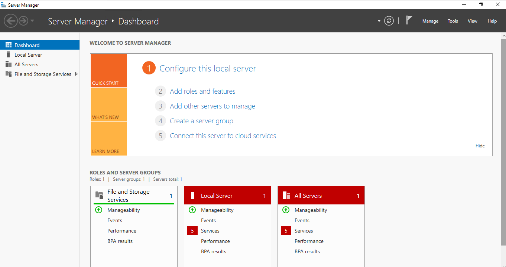
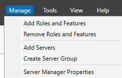

Setup for a Small to Medium-Sized Company

# 1. Plan

The plan is to set up infrastructure for a small to medium-sized company.
The infrastructure will be a combination of both physical and virtual machines.

# 2. Needed Hardware

The needed hardware is as follows:

* 1 Firewall
* 2 Servers
* 1 Test PC

# 3. Needed Software

The needed software is as follows:

* OPNsense
* Windows Server 2022
* Hyper-V

# 4. The Setup

### First Server

1. Install Windows Server 2022
 * Name the computer (e.g., "Server1")
 * Set a static IP address
* Go to manage and add roles.
    * Activate Hyper-V
    * Activate Active Directory Domain Services (ADDS)
    * Activate Domain Name System (DNS)
    * Activate Dynamic Host Configuration Protocol (DHCP)

### After Rebooting the Server

1. Install the Firewall
 * Open Hyper-V Manager and create a new virtual switch with a VLAN
 * Install OPNsense on a virtual machine
 * Configure OPNsense to use 2 virtual switches. One of them needs a VLAN
 * Start the OPNsense virtual machine without secure boot
 * Finish the installation of OPNsense
    * Make sure that the `Wan` does not have the `VLAN` tag and the `LAN`  hase the `VLAN` tag
	* Remember to make OPNsense boot from disk 
  
2. Configuration of the Active Directory Domain Services
 * Click on the flag at the top press promote domain
    * Crete new forest and give your domain a name e.g kim.robbin
    * Follow the wizard to create the domain

3. Confiur the DNS serves 

4. Configure the DHCP 

### Second Server (Backup)

1. Install Windows Server 2022
 * Name the computer (e.g., "Server2")
 * Set a static IP address
 * Activate Hyper-V
 * Join the server to the Active Directory domain

2. Set up the dns and ADDS

### Test PC

1. Install a client operating system (e.g., Windows 10/11)
 * Join the Domain
 * Do a internet speed test
 * Check the share folder

### 5.  The Network 

 

 
 

### 6. IP Documentation 

| Device | IP Address | Subnet Mask | Default Gateway | VLAN ID | Exstern IP | 
| --- | --- | --- | --- | --- | --- |
| Server1 | 192.168.35.10 | 255.255.255.0 | 192.168.35.1 | 335 | 10.2.3.8 |
| Server2 | 192.168.35.20 | 255.255.255.0 | 192.168.35.1 | 335 | 10.2.3.8 |
| OPNsense | 192.168.35.1 | 255.255.255.0 | 192.168.35.1 | 335 | 10.2.3.8 |
| Client 1 | 192.168.35.101 | 255.255.255.0 | 192.168.35.1 | 335 | 10.2.3.8

### Images 

 

 

 

